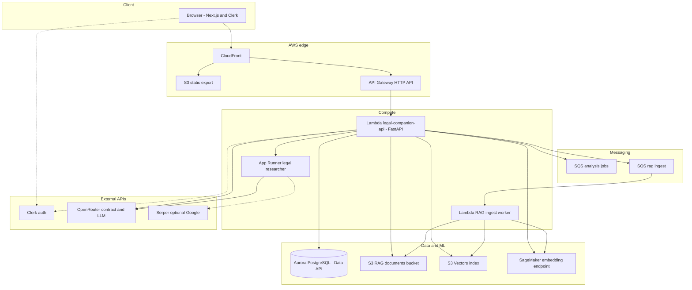
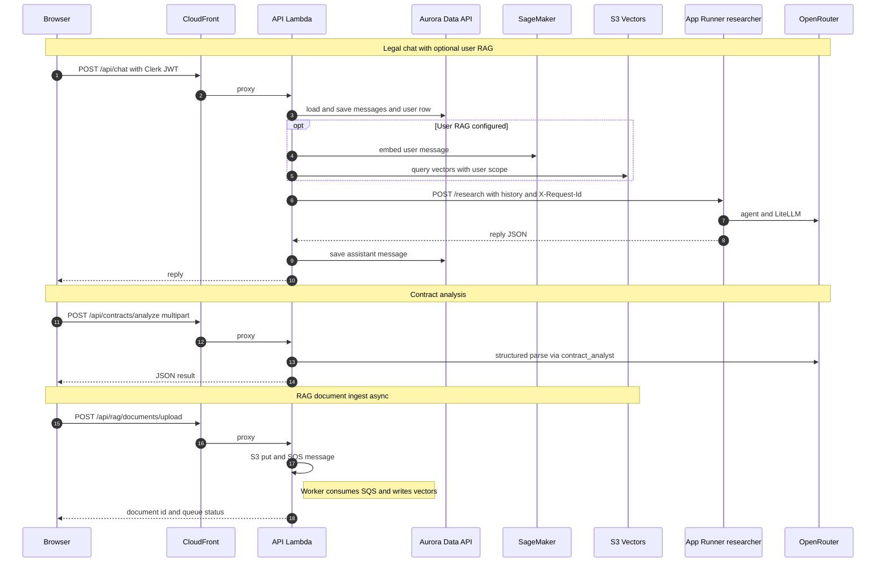

# Legal Companion (LegalTech AI)

An AI-assisted **legal workspace**: authenticated users can run **legal research chat** (browsing plus LLM agents), **analyze contracts** (structured pain points, red flags, risks), and **upload documents for RAG** so answers can cite their own files. The stack is **Next.js and Clerk** on the client, **FastAPI on AWS Lambda** behind **API Gateway** and **CloudFront**, with **Aurora PostgreSQL (Data API)**, **S3 Vectors plus SageMaker embeddings**, and a separate **research microservice on AWS App Runner**.

---

## What the product does

| Area | Behavior |
|------|----------|
| **Legal chat** | User messages are stored in Aurora; optional **user RAG** retrieves chunks from **S3 Vectors**; the API then calls the **researcher service** (App Runner) for the LLM reply with browsing and tools. |
| **Contract analysis** | PDF or text upload from the UI; **API Lambda** runs **`contract_analyst`** against **OpenRouter** and returns structured JSON rendered as Markdown in the app. |
| **RAG documents** | User uploads go to **S3**; a message on **`legal-companion-rag-ingest`** drives a **worker Lambda** that chunks text, embeds via **SageMaker**, and writes vectors and metadata to **S3 Vectors**. |
| **Dashboard and activity** | Product analytics and journey events persisted in Aurora. |
| **Auth** | **Clerk** JWT validated in the API (`CLERK_JWKS_URL` and issuer); the frontend sends `Authorization: Bearer` on API calls. |

---

## Repository layout

```text
legalTech/
├── frontend/          # Next.js (App Router), Clerk, chat and contract UI
├── backend/
│   ├── api/           # FastAPI app, Mangum Lambda handler, routes, RAG retrieval
│   ├── database/      # Aurora Data API client, models, Pydantic schemas
│   ├── contract_analyst/   # OpenRouter structured contract analysis
│   ├── ingest/        # RAG SQS worker, S3 Vectors search and ingest Lambdas, rag_core
│   ├── researcher/    # App Runner service: agents, Playwright MCP, Serper optional
│   └── tests/         # Pytest suite
├── terraform/         # AWS infra by numbered parts
└── scripts/           # Operational helpers
```

---

## Infrastructure (Terraform)

| Part | Path | Role |
|------|------|------|
| **2** | `terraform/2_sagemaker/` | Embedding **SageMaker endpoint** (query and ingest share the same model name in env). |
| **3** | `terraform/3_ingestion/` | **S3 Vectors** bucket, **RAG ingest** Lambda and IAM, **`legal-companion-rag-ingest`** queue. |
| **4** | `terraform/4_researcher/` | **ECR** and **App Runner** for the **researcher** HTTP service (`POST /research`). |
| **5** | `terraform/5_database/` | **Aurora Serverless** and secrets; **RDS Data API** enabled for Lambda. |
| **6** | `terraform/6_agents/` | **SQS** `legal-companion-analysis-jobs`, DLQ, IAM for **planner and agent Lambdas**; API can invoke these by name. |
| **7** | `terraform/7_frontend/` | **S3** static site, **CloudFront** (SPA plus `/api/*` to API Gateway), **HTTP API** to **`legal-companion-api` Lambda**, env wiring (DB, Clerk, `APP_RUNNER_URL`, RAG bucket, queues, OpenRouter, SageMaker, vector index). |

Typical apply order: **5, then 2, 3, 4, 6, 7** (database and embeddings before RAG; researcher state before API Lambda reads `APP_RUNNER_URL`).

---

## End-to-end architecture



---

## How services talk to each other



---

## Backend modules (concise)

- **`backend/api/main.py`** — FastAPI routes: user profile, legal chats, **`POST /api/chat`** (DB, optional RAG, researcher HTTP client), **`POST /api/contracts/analyze`**, RAG document list and upload, activity logging. Emits **structured JSON logs** (`legaltech.flow`) for CloudWatch tracing.
- **`backend/api/rag_retrieval.py`** — Embed query via SageMaker, **QueryVectors** on S3 Vectors, filter by `clerk_user_id` and ingest kind, return Markdown context.
- **`backend/ingest/rag_ingest_worker.py`** — SQS consumer: S3 **GetObject**, text extract, chunk, embed, **PutVectors** in batches.
- **`backend/researcher/server.py`** — **`POST /research`**: primary agent (Playwright MCP), evaluator, optional Serper refinement; uses **`X-Request-Id`** for correlation with the API.
- **`backend/database/src/`** — **DataAPIClient**, **Database** models, Pydantic **schemas**.
- **`backend/contract_analyst/`** — Text extraction (PDF via pypdf), **OpenRouter** structured output for contract analysis.

---

## Frontend (concise)

- **`frontend/src/app/(app)/`** — Authenticated shell: **dashboard**, **chat** at `/chat`, **contract** at `/chat/contract`, **RAG** documents.
- **`frontend/src/lib/api.ts`** — Calls to **`/api/*`** with Clerk **`getToken`**, HTML-safe error handling for CloudFront or gateway error pages.
- **`frontend/src/components/chat-markdown.tsx`** — **react-markdown** for assistant Markdown (headings, lists, emphasis).

Use **`NEXT_PUBLIC_*`** for Clerk and the API base URL (often the same CloudFront origin with `/api` path).

---

## Local development

- **Frontend:** `cd frontend`, install deps, `npm run dev`; configure `.env.local` (Clerk, API URL).
- **Backend API:** use **`uv`** in `backend/` per workspace layout; set Aurora and Clerk env vars for full DB routes.
- **Researcher:** `cd backend/researcher`, `uv sync`, configure OpenRouter, optional Serper, optional legal ingest URL in `.env`.
- **Tests:** `cd backend && uv sync --group dev && uv run pytest tests -v`.

---

## Observability

- **CloudWatch** for API Lambda, RAG worker, App Runner, and API Gateway.
- **Correlation:** log field `"channel": "service_flow"` with `trace_id`, `service`, `step`, `target`, and timings; API forwards **`X-Request-Id`** to the researcher and may set **`api_trace_id`** on RAG ingest messages.

---

## Related docs

- **`terraform/README.md`** — Terraform notes for this repo.
- **`frontend/README.md`** — Next.js template notes; production deploy is **S3 and CloudFront** (Part 7).
